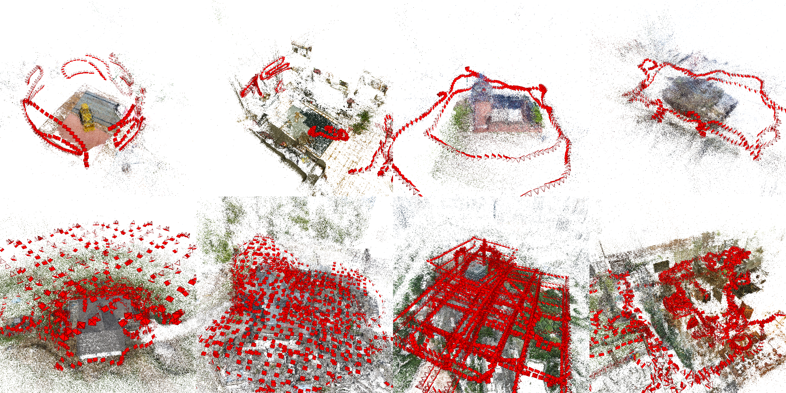

# FastMap: Revisiting Dense and Scalable Structure from Motion
A fast structure from motion pipeline written in Pytorch for images densely convering a scene.

\[[Paper](http://arxiv.org/abs/2505.04612)\] \[[Project Page](https://jiahao.ai/fastmap)\]



## Installation
Currently we only support Linux.
1. Install [PyTorch](https://pytorch.org) following the instructions in the official website.
2. Install other Python packages with the following commands
```bash
pip install trimesh "pyglet<2" pyyaml dacite loguru prettytable psutil
```
```bash
pip install git+https://github.com/jiahaoli95/pyrender.git
```
3. Install [COLMAP](https://colmap.github.io/install.html) following the instructions in the official website. If you already have the matching databases (see below) and want to run FastMap starting from that, this step is optional.

## Usage

### Basics
The structure from motion pipeline consists of two parts: feature matching and pose estimation. We use the image matching routines in [COLMAP](https://colmap.github.io/tutorial.html) to obtain a [database](https://colmap.github.io/database.html) that contains matching results, and feed it to FastMap to estimate the camera poses and triangulate a sparse point cloud. Given a directory of images (possibly with nested directory structrures), the easiest way to run the pipeline using the default configuration is (assuming you have a monitor connected):
```bash
# keypoint detection and feature extraction
colmap feature_extractor --database_path /path/to/your/database.db --image_path /path/to/your/image/directory
# matching
colmap exhaustive_matcher --database_path /path/to/your/database.db
# pose estimation with FastMap (if you do not need the colored point cloud, you may omit the --image_dir option)
python run.py --database /path/to/your/database.db --image_dir /path/to/your/image/directory --output_dir /your/output/directory
```
An interactive visualization will appear after FastMap finishes, and the results will be stored in the provided output directory in the same [format](https://colmap.github.io/format.html) as COLMAP. Please refer to the official COLMAP [tutorial](https://colmap.github.io/tutorial.html) and [command-line interface guide](https://colmap.github.io/cli.html) for various options that can be passed to the feature extractor and matcher (e.g., accelerating with GPUs).

### Configuration
There are many hyper-parameters and options that allow you to control the bahavior of FastMap. They are specified as a set of dataclasses (with default values) in `fastmap/config.py`. To change the config, you can pass the path of a YAML file to `run.py`
```bash
python run.py --config /path/to/your/config.yaml --database /path/to/your/database.db --image_dir /path/to/your/image/directory --output_dir /your/output/directory
```
The YAML file only needs to specify the parameters you want to change; for example (see `fastmap/config.py` for all available options):
```yaml
distortion: 
  num_levels: 5
epipolar_adjustment:
  num_irls_steps: 4
  num_prune_steps: 2
sparse_reconstruction:
  reproj_err_thr: 10.0
```

### Device
By default, FastMap will run on the first available GPU. If you want to run it on another device, use the `--device` option
```bash
python run.py --device cuda:2 --database /path/to/your/database.db --image_dir /path/to/your/image/directory --output_dir /your/output/directory
```
So far we only support running on a single GPU.

### Headless Mode
If you are running on a server without a monitor connected, you need to pass the `--headless` flag
```bash
python run.py --headless --database /path/to/your/database.db --image_dir /path/to/your/image/directory --output_dir /your/output/directory
```

### Camera Assumptions
**Default Camera Model:** By default, we assume a [`SIMPLE_RADIAL`](https://colmap.github.io/cameras.html) camera model with the principal point at the center, and the two unknown parameters being the focal length and radial distortion. Our method groups images believed to share the same camera parameters according to the following:
- Images from different subdirectories are considered to have different intrinsics.
- Within a subdirectory, images with the same size and whose EXIF specifies the same focal length are considered to be from the same camera.
- For images within the same directory that lack EXIF data, those of the same size are considered to be from the same camera.

**Pinhole Camera:** If you are sure that the distortion is extremely small and a pinhole camera model is appropriate, you can use the `--pinhole` flag to tell FastMap not to estimate the distortion parameter, which can save some time. In practice, however, even distortions that are imperceptible to the human eye can have a negative effect on the estimation of focal length and pose.

**Calibrated Camera:** If the cameras are calibrated, and the focal length and principal point information are stored in the database, you can pass the `--calibrated` flag to use the known intrinsics. While the final focal length might still be different after optimization, the principal point will remain fixed. Note that if you use this flag, FastMap assumes it is a pinhole camera model, so the images should be undistorted properly before feature extraction and matching.


### Visualization
We include a simple visualizer for inspecting the results in the COLMAP format (which FastMap adopts). COLMAP supports outputting multiple models, so the results are stored in numbered subdirectories, such as `sparse/0`, `sparse/1`, and so on. FastMap always outputs only one model and abandons the images that fail to be registered, but to be consistent, we still use this naming convention, and so everything is stored in the `sparse/0` subdirectory. To interactively visualize a model stored in `sparse/0` (including the camera poses and point cloud), use the following command:
```bash
python -m fastmap.vis /your/output/directory/sparse/0
```
You can pass options to the script to control the viewer behavior. For example, if you want a different point size for the point cloud, you can use
```bash
python -m fastmap.vis /your/output/directory/sparse/0 --viewer_options point_size=5
```
Please see `fastmap/vis.py` for a complete set of supported options.

## Data and Reproduction
Images, pre-computed databases and ground truths to reproduce our benchmarks are hosted [here](https://huggingface.co/datasets/whc/fastmap_sfm). Download a subset to start playing with FastMap. 

GLOMAP/COLMAP container:
- the singularity container `.sif` is in the data repo.
- the docker container and Dockerfile are [here](https://hub.docker.com/r/haochenw/glomap/tags)

## BibTeX
If you use this tool for your research please cite the following paper
```bibtex
@article{2505.04612v1,
    Author        = {Jiahao Li and Haochen Wang and Muhammad Zubair Irshad and Igor Vasiljevic and Matthew R. Walter and Vitor Campagnolo Guizilini and Greg Shakhnarovich},
    Title         = {FastMap: Revisiting Dense and Scalable Structure from Motion},
    Eprint        = {2505.04612v1},
    ArchivePrefix = {arXiv},
    PrimaryClass  = {cs.CV},
    Year          = {2025},
    Month         = {May},
    Url           = {http://arxiv.org/abs/2505.04612v1},
    File          = {2505.04612v1.pdf}
}
```
